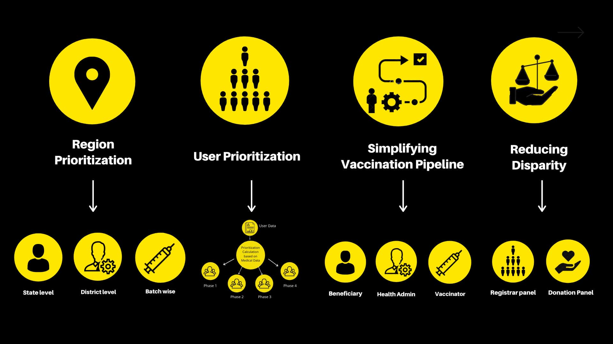
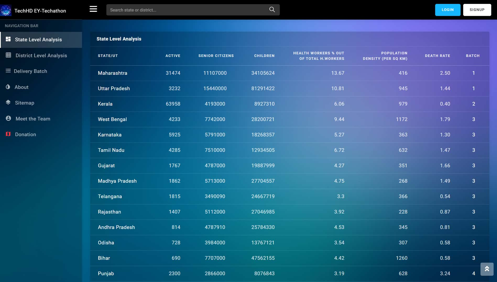
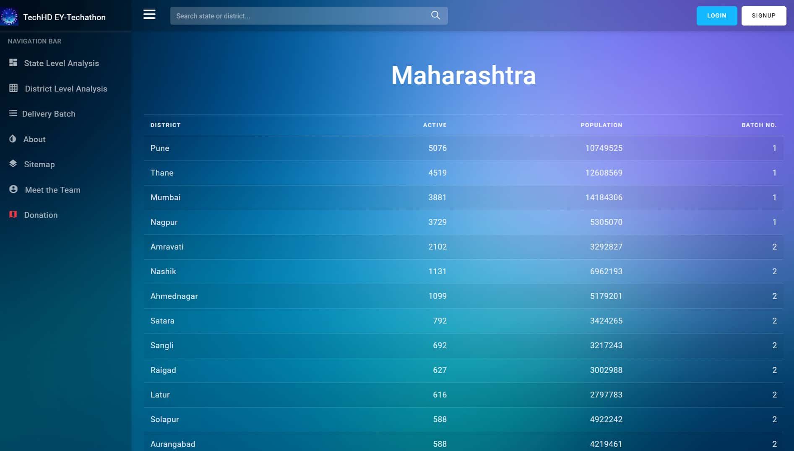
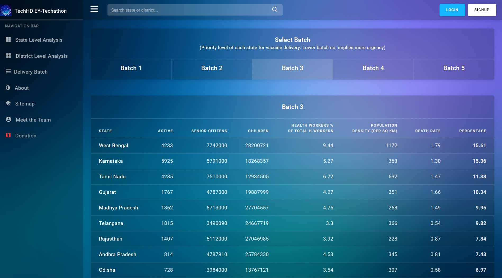
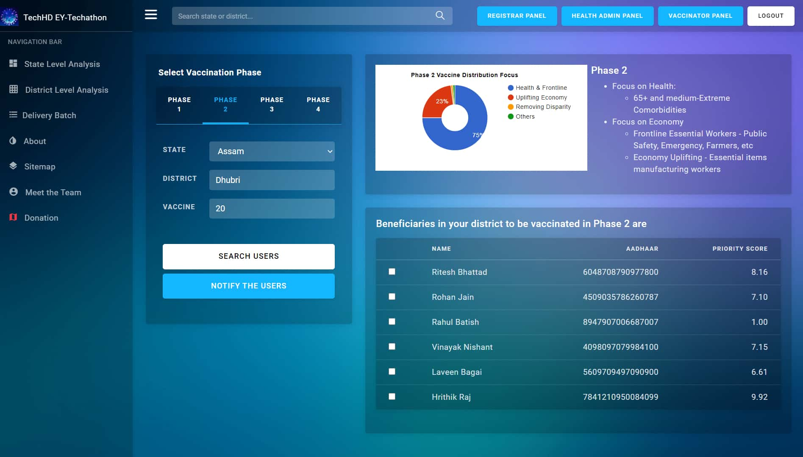
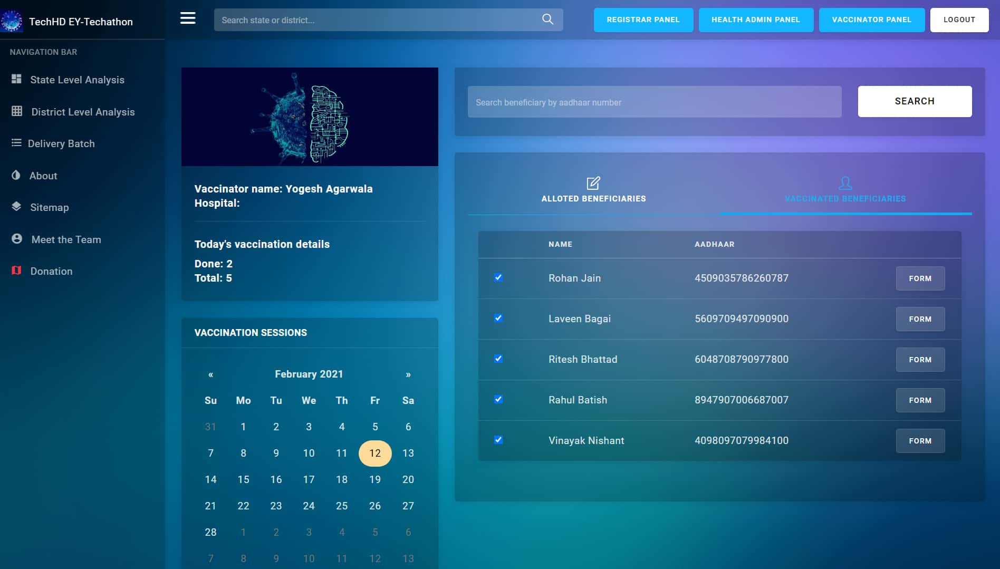
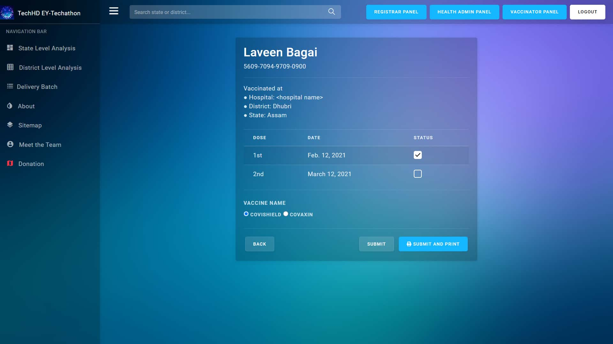
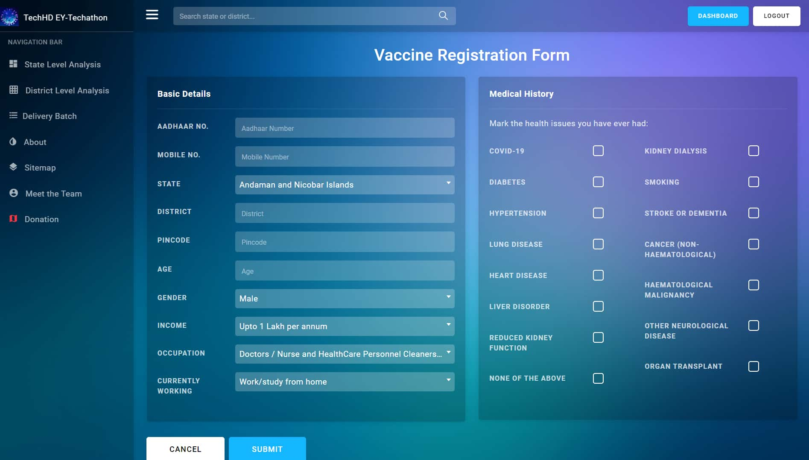
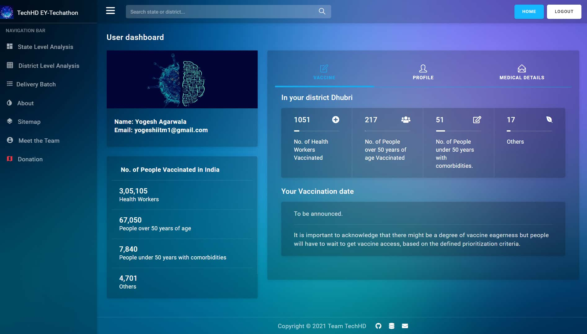
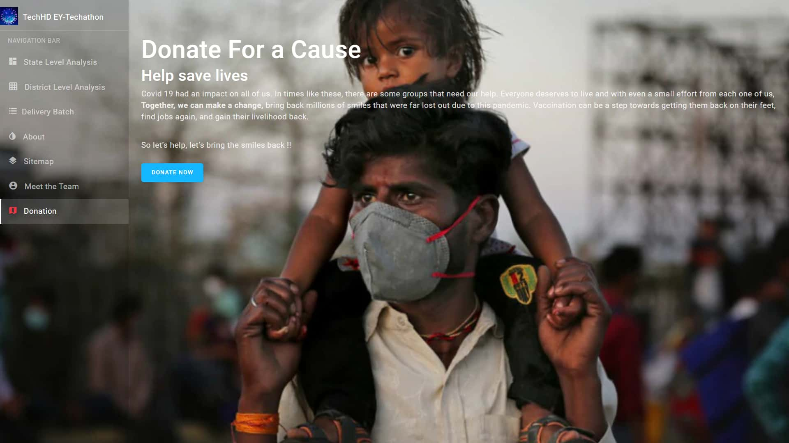

# [EY-Techathon: Prioritization of Covid-19 Vaccine Delivery](https://techhd.herokuapp.com/)

**WebApp: https://techhd.herokuapp.com/ <br>**

<!--  -->
<a href="https://techhd.herokuapp.com/"></a>

## Project Overview

Here we have tried to help the government make informed decisions around epidemiological and vaccine supply circumstances by predicting India's more critical segments that need to be catered with vaccine deliveries as prior as possible.

We went through various census report estimates, WHO reports, and other state websites to fetch and combine all these data features and made our datasets. We then add and update the data daily with the number of covid cases in each state and carry out our ML algorithms.

And hence we ended up with the following features that we used for batch predictions:
State Data:
1) Active Cases ([covid19india.org](https://www.covid19india.org/) website APIs)
2) Population Density 2020 (estimated: since the census is done every 10 years(2021 next))
3) Death rate (no.of deaths/total confirmed cases x100)
4) Heath Workers Present in the State (WHO reports)
5) Senior Citizens(60+)
6) Children(0-14yrs)
7) Allotted Hospital Beds for Covid Patients in each state
8) Accessibility of each state( based on National Highways lengths and connections within the state

We then run our ML clustering algorithms through all the features and load them into our ranking algorithms (considering several metrics and features) to figure out the Importance and urgency of vaccine deliveries in each state.

Our datasets are automatically updated daily to accommodate and make the predictions based on the latest information regarding the number of active covid cases of each state.


## Webapp Images

<a href="https://techhd.herokuapp.com/"></a>

##### State Level Analysis
<a href="https://techhd.herokuapp.com/"></a>

##### District Level Analysis
<a href="https://techhd.herokuapp.com/"></a>

##### Batch wise Analysis
<a href="https://techhd.herokuapp.com/"></a>

##### Health Administrator Panel
<a href="https://techhd.herokuapp.com/"></a>

##### Vaccinator Panel
<a href="https://techhd.herokuapp.com/"></a><br>
<a href="https://techhd.herokuapp.com/"></a>

##### User Registration Form
<a href="https://techhd.herokuapp.com/"></a>

##### User Dashboard
<a href="https://techhd.herokuapp.com/"></a>

##### Donation Panel
<a href="https://techhd.herokuapp.com/"></a>

## Tech Stack used

1. **Machine Learning:** NumPy, Pandas, Matplotlib, Scikit-learn
2. **Frontend:** HTML, CSS, JS, Bootstrap
3. **Backend:** Python, Django
4. **Database:** Heroku Postgres
5. **Deployment:** Github + Heroku

<!--
## How to run this web app locally
```
pip install -r requirements.txt
python manage.py makemigrations
python manage.py migrate
python manage.py runserver
```
-->


## Local Setup
1. **Setup virtual environment**
    - Clone this repository into local system and change the directory.
      ```sh
      git clone https://github.com/yogeshiitm/TechHD.git
      cd TechHD/
      ```
    - Install virtualenvwrapper.
      ```sh
      pip install virtualenvwrapper-win
      ```
    - Create virtual environment: 
      ```sh
      mkvirtualenv <venv_name>
      ```
    - Activating the venv: 
      ```sh
      workon <venv_name>
      ```
    - Exiting from the venv: 
      ```sh
      deactivate
      ```

2. **Django setup**
    - Install the required packages
        ```sh
        pip install -r requirements.txt
        ```
    - Apply migrations
        ```sh
        python manage.py makemigrations
        python manage.py migrate
        ```
    - Run the server:
        ```sh
        python manage.py runserver
        ```
    - Open http://localhost:8000 to view the webapp in the browser.

## Sitemap


<!--
<table>
  <tr>
    <td></td>
    <td></td>
  </tr>
</table>
-->
 
    
## Project links

1. **Website:** https://techhd.herokuapp.com/ (currently inactive)<br> 
2. **Github:**  https://github.com/yogeshiitm/TechHD <br>
3. **Webapp video 1:** [click Here](https://youtu.be/0v2HDx5x9GE) <br>
4. **Webapp video 2:** [click Here](https://youtu.be/K1J6A-udGK4) <br>
5. **Datasets for ML:** [click here](https://drive.google.com/drive/folders/1MxQ8c2Su2RbiA82VvIu6WMBONd-L8vy4?usp=sharing)
6. **Prediction analysis procedure:** [click here](https://drive.google.com/file/d/1n9-S84md7RU-d_7q_66IQCegr6aXivbj/view?usp=sharing)

## Team Members
<!--
1. **Vinayak Nishant Gudipaty** ([Linkedin](https://www.linkedin.com/in/vinayak-nishant-gudipaty-907171197/)) - Machine Learning + Backend
2. **Yogesh Agarwala** ([Linkedin](https://www.linkedin.com/in/yogeshiitm/)) - Backend + Frontend 
3. **Laveen Bagai** ([Linkedin](https://www.linkedin.com/in/laveen-bagai-385484202/)) - Frontend
4. **Ritesh Bhattad** ([Linkedin](https://www.linkedin.com/in/ritesh-bhattad-a9bb2b194/)) - Frontend 
-->
1. **Vinayak Nishant Gudipaty** - Machine Learning + Backend
2. **Yogesh Agarwala** - Backend + Frontend 
3. **Laveen Bagai** - Frontend
4. **Ritesh Bhattad** - Frontend 
